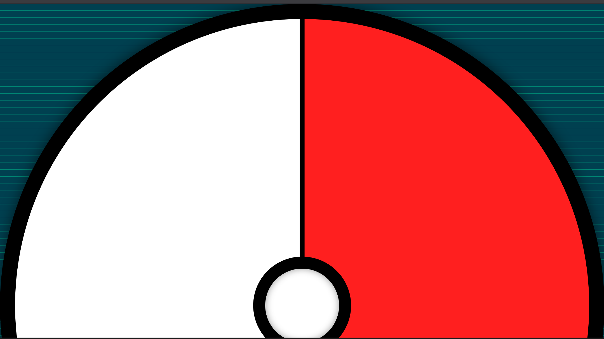
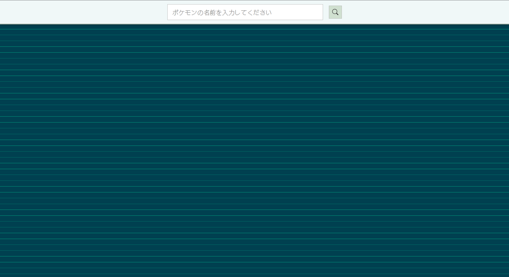
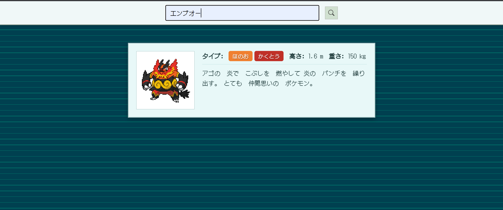

# SZPP Web開発部夏休みオンライン回 ～ポケモン図鑑を作ろう～
<h3>作成日：2025/08/03</h3>
<h3>作成者：Arm203</h3>

## 今回の目的
* Webアプリケーションの作り方・構成を学ぶ.
* jQueryの使い方を学ぶ
* APIと呼ばれるデータの取得方法を学ぶ

## 事前準備
`https://github.com/ayumu203/szpp-pokemon-2025`にアクセスし、緑色の「Code」からZIP形式でファイルを「ドキュメント」などにダウンロードする. \
ダウンロードしたファイルを解凍し、VSCodeなどのエディタで開く.
VSCodeの拡張機能でLive Serverをインストールし、右下の「Go live」をクリック. 

## 今回の手順
1. クローンしたファイルの動作確認
2. 入力フォームの作成
3. イベントの検知と検索関数の作成
4. APIの利用
5. ポケモンの情報を表示

## クローンしたファイルの動作確認
### 実行画面

クリックをすると...

入力フォームはないね...

ちなみに最終完成形はこんな感じ～

## 入力フォームの作成
今回もみんなで一緒に書いていこうか
```html
<!DOCTYPE html>
<html lang="ja">
<head>
    <meta charset="UTF-8">
    <meta name="viewport" content="width=device-width, initial-scale=1.0">
    <title>ポケモン図鑑</title>
    <link rel="stylesheet" href="index.css">
</head>
<body>
    <div class="pokeball"></div>

    <!-- ここを実装していくよー -->
    <div id="pokemonSearchFormContainer">
        <form id="pokemonSearchForm">
            <input type="text" id="pokemonName" name="pokemonName" placeholder="ポケモンの名前を入力してください">
            <button type="button" id="pokemonSearchButton" title="検索">
                <!-- ここだけはコピペでオッケー -->
                <svg xmlns="http://www.w3.org/2000/svg" width="16" height="16" fill="currentColor" viewBox="0 0 16 16">
                    <path d="M11.742 10.344a6.5 6.5 0 1 0-1.397 1.398h-.001c.03.04.062.078.098.115l3.85 3.85a1 1 0 0 0 1.415-1.414l-3.85-3.85a1.007 1.007 0 0 0-.115-.1zM12 6.5a5.5 5.5 0 1 1-11 0 5.5 5.5 0 0 1 11 0z"/>
                </svg>
            </button>
        </form>
    </div>
    <!-- ここまで -->

    <script src="https://code.jquery.com/jquery-3.7.1.js" integrity="sha256-eKhayi8LEQwp4NKxN+CfCh+3qOVUtJn3QNZ0TciWLP4=" crossorigin="anonymous"></script>
    <script src="animation.js"></script>
    <script src="main.js"></script>
</body>
</html>
```

## イベントの検知と検索関数の作成
### jQueryの復習
イベントの検知の仕方、そろそろ覚えてきたかな？
```javascript
$("#監視対象のID").on("イベント", function(){
    // イベント発生時に実行する処理
});
```

### イベントの検知の実装
```javascript
$("#pokemonSearchButton").on("click", handleSearch);

$("#pokemonName").on("keypress", function(event) {
    if (event.which === 13) {
        event.preventDefault(); 
        handleSearch();
    }
});
```

## ポケモンの名前から図鑑番号を取得する
### jQueryの復習2
入力の受け取り方も覚えてる？
```javascript
$("#データを取ってきたいタグのID).val();
// 前後の空白を消すことができる.
$("#データを取ってきたいタグのID).val().trim();
```

### オブジェクトとは
JavaScriptにはキーと値のペアでデータを管理することのできるオブジェクトと呼ばれるデータ構造がある。 
```javascript
const pokemonNameMap = {
    "ピカチュウ": 25,
    "イシツブテ": 74,
    "コダック": 54
    hoge:123
};
```
データは次のような取り方ができる.
```javascript
// キーを使って値を取得
pokemonNameMap.hoge; // 123
// 主にダブルクオーテーションがついている場合はカッコで取得
pokemonNameMap["ピカチュウ"]; // 25
```

### falthyな値
JavaScriptでは、以下の値は「false」として扱う。
- `null`
- `undefined`
- `0`
- `""`（空文字列）
- `NaN`（Not a Number）
- `false`
だからこれらの値に「!」を取ることで変な値をまとめて弾くことができる. 
```javascript
const searchPokemonByName = async () => {
    const pokemonName = $("#pokemonName").val().trim();
    if (!pokemonName) {
        alert("ポケモンの名前を入力してください。");
        return null;
    }
    try {
        const response = await fetch('nameToId.json');
        if (!response.ok) {
            throw new Error('JSONファイルの読み込みに失敗しました。');
        }
        const pokemonNameMap = await response.json();
        if (pokemonNameMap.hasOwnProperty(pokemonName)) {
            return pokemonNameMap[pokemonName];
        } else {
            alert(`「${pokemonName}」というポケモンは見つかりませんでした。`);
            return null;
        }
    } catch (error) {
        console.error(error);
        alert('ポケモンデータの照合に失敗しました。');
        return null;
    }
};
```

## APIの利用
### jQueryの活用法
jQueryではAjaxと呼ばれる手法を使って他のサーバと通信してデータを取得することができる. \
以下のように記述を行う. 
```javascript
$.ajax({
    url: '取得したいデータのURL',
    type: 'GET', // データの取得方法
    dataType: 'json', // 取得するデータの形式
    success: function(data) {
        // データの取得に成功したときの処理
    },
    error: function(request, status, error) {
        // データの取得に失敗したときの処理
    }
});
```

今回はPokeAPIというポケモンのデータを取得できるAPIを使う. \
PokeAPIのURLは`https://pokeapi.co/api/v2/pokemon/{図鑑番号}`でポケモンのデータを取得することができる. \
今回返ってくるデータはJSON形式なのでJSONの扱い方が参考になる. \
実際には自身でJSONを読んでデータの位置などを確かめるが、今回はもう特定してある. \
試しにデータを見てみよう(`https://pokeapi.co/api/v2/pokemon/1`). 
```javascript
const fetchPokemonData = (pokemonId) => {
    return new Promise((resolve, reject) => {
        $.ajax({
            url: `https://pokeapi.co/api/v2/pokemon/${pokemonId}`,
            type: 'GET',
            dataType: 'json',
            success: function(pokemonData) {
                const imageUrl = pokemonData.sprites.front_default;
                const types = pokemonData.types.map(typeInfo => typeInfo.type.name); 
                const height = pokemonData.height / 10;
                const weight = pokemonData.weight / 10;

                // 説明文だけは別途取得しなきゃいけない
                $.ajax({
                    url: pokemonData.species.url,
                    type: 'GET',
                    dataType: 'json',
                    success: function(speciesData) {
                        const flavorTextEntry = speciesData.flavor_text_entries.find(
                            (entry) => entry.language.name === "ja"
                        );
                        const description = flavorTextEntry 
                            ? flavorTextEntry.flavor_text.replace(/[\n\f]/g, " ") 
                            : "説明文が見つかりませんでした。";
                        
                        resolve({ imageUrl, types, height, weight, description });
                    },
                    error: function(request, status, error) {
                        reject(new Error("ポケモンの説明文を取得できませんでした: " + error));
                    }
                });
            },
            error: function(request, status, error) {
                reject(new Error("ポケモンのデータを取得できませんでした: " + error));
            }
        });
    });
};
```

## ポケモンの情報を表示する関数の作成
この辺は前回の資料なども参考にしてみると良いと思う.
```javascript
// このオブジェクトはコピペでいい
const typeColors = {
    normal: { name: 'ノーマル', color: '#A8A878' },
    fire: { name: 'ほのお', color: '#F08030' },
    water: { name: 'みず', color: '#6890F0' },
    electric: { name: 'でんき', color: '#F8D030' },
    grass: { name: 'くさ', color: '#78C850' },
    ice: { name: 'こおり', color: '#98D8D8' },
    fighting: { name: 'かくとう', color: '#C03028' },
    poison: { name: 'どく', color: '#A040A0' },
    ground: { name: 'じめん', color: '#E0C068' },
    flying: { name: 'ひこう', color: '#A890F0' },
    psychic: { name: 'エスパー', color: '#F85888' },
    bug: { name: 'むし', color: '#A8B820' },
    rock: { name: 'いわ', color: '#B8A038' },
    ghost: { name: 'ゴースト', color: '#705898' },
    dragon: { name: 'ドラゴン', color: '#7038F8' },
    dark: { name: 'あく', color: '#705848' },
    steel: { name: 'はがね', color: '#B8B8D0' },
    fairy: { name: 'フェアリー', color: '#EE99AC' }
};


const showPokemonData = (pokemonData) => {
    $("#pokemonImage").attr("src", pokemonData.imageUrl);
    
    const typesContainer = $("#pokemonTypes");
    typesContainer.html("<strong>タイプ:</strong> "); // ラベルを先に追加
    
    // タイプの数だけ色付きのバッジを生成
    pokemonData.types.forEach(typeKey => {
        if (typeColors[typeKey]) {
            const typeInfo = typeColors[typeKey];
            const typeSpan = $('<span></span>')
                .text(typeInfo.name)
                .addClass('type-badge')
                .css('background-color', typeInfo.color);
            typesContainer.append(typeSpan);
        }
    });

    $("#pokemonHeight").html(`<strong>高さ:</strong> ${pokemonData.height} m`);
    $("#pokemonWeight").html(`<strong>重さ:</strong> ${pokemonData.weight} kg`);
    $("#pokemonDescription").text(pokemonData.description);
    
    $("#pokemonInfoContainer").show();
};
```

### 作成した関数を呼び出す
```javascript
async function handleSearch() {
    try {
        const pokemonId = await searchPokemonByName();
        if (pokemonId) {
            const pokemonData = await fetchPokemonData(pokemonId);
            showPokemonData(pokemonData);
        }
    } catch (error) {
        console.error("処理中にエラーが発生しました:", error);
    }
}
```

## 動作確認
動かなければ、資料見返したり、質問プリーズ